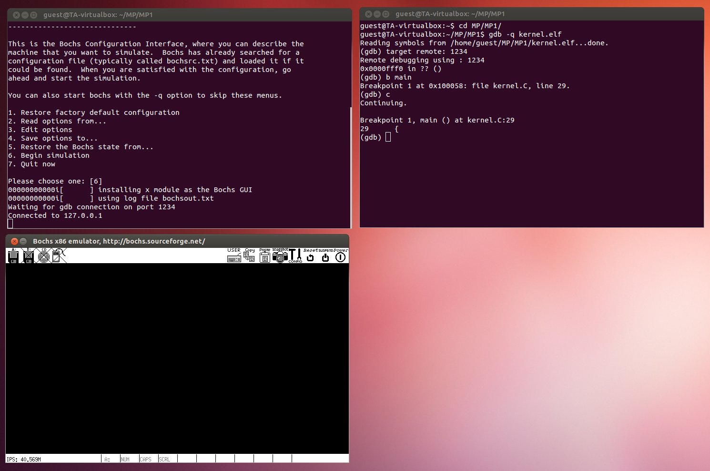
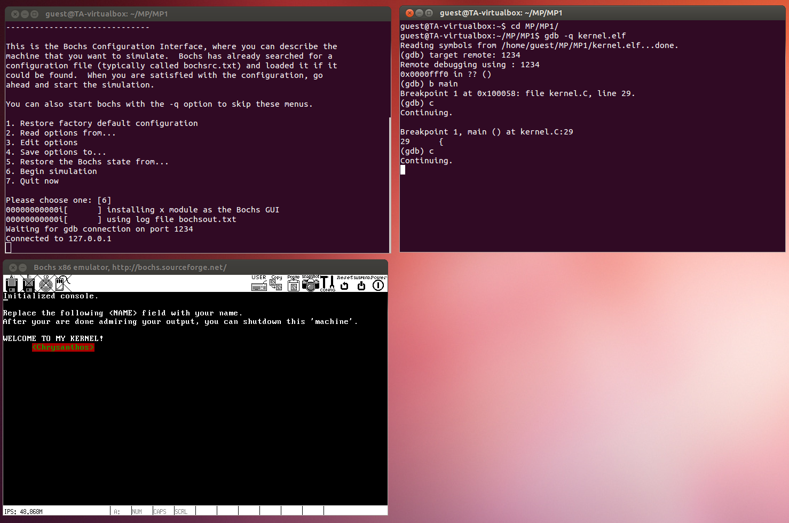

# The Bochs Environment with GDB Integration
## Bochs
1. Remove the existing Bochs version
```
sudo apt-get remove bochs
```
2. [Download Bochs v2.6.8](https://sourceforge.net/projects/bochs/files/bochs/2.6.8/bochs-2.6.8.tar.gz/download)
3. Extract the archive
4. Under the directory of the Bochs source code
```
sudo ./configure --enable-gdb-stub
sudo apt-get install xorg-dev
sudo make
sudo make install
```
## MP
1. Open `bochsrc.bxrc` and add the following
```
...
# GDB Debugging stub
gdbstub: enabled=1, port=1234, text_base=0, data_base=0, bss_base=0
...
```
2. Open `makefile`
	1. Replace **all** `.bin` to `.elf`
	2. Add the “-g” flag at each of the compile steps to produce an object file containing the debug information.
```
...
# ==== UTILITIES ====
utils.o: utils.H utils.C
	gcc $(GCC_OPTIONS) -g -c -o utils.o utils.C
# ==== DEVICES ====
console.o: console.H console.C
	gcc $(GCC_OPTIONS) -g -c -o console.o console.C
# ==== KERNEL MAIN FILE ====
kernel.o: kernel.C
	gcc $(GCC_OPTIONS) -g -c -o kernel.o kernel.C
...
```
3. Open`copykernel.sh` and replace `.bin` to `.elf`
4. Open `linker.ld` and remove the `OUTPUT_FORMAT("binary")`
5. Open 2 terminal windows and navigate both to the Bochs source code

## Terminal 1
```
make
sudo ./copykernel.sh
bochs -f bochsrc.bxrc
```
This message should be displayed `Waiting for gdb connection on port 1234`

## Terminal 2
```
gdb -q kernel.elf
```
If this message displayed `Reading symbols from home/../kernel.elf…done.` then continue else rebuild the MP. (You may need to change for example you name to take effect)
```
target remote: 1234
```
In Terminal 1 this messages will appear `Connected to 127.0.0.1`

## GDB
Adding break point on a line number `(gdb) b sample.c:4`

Adding break point with a function name `(gdb) b main`

To continue the program `(gdb) c`

To quit gdb `(gdb) quit`

## Examples
Setting a breakpoint at funcion main.


Continuing the program.

